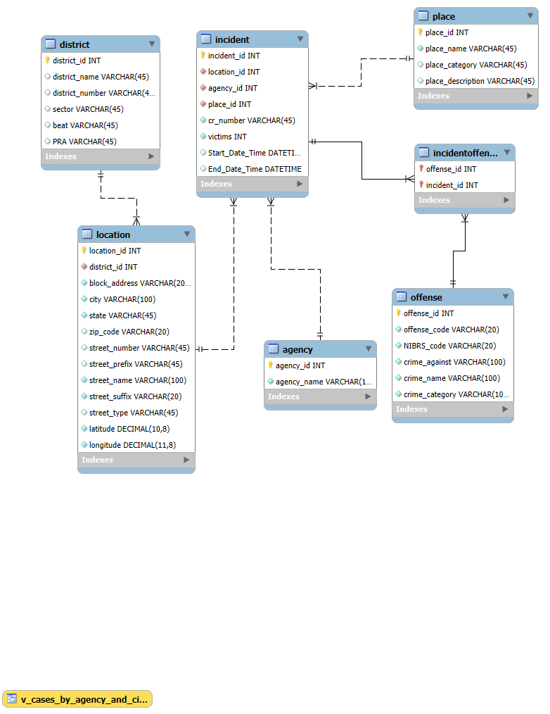

# 2023 Montgomery County Police Database

A relational database project built with MySQL to organize and analyze Montgomery County police incident data.

## Overview

This project was originally developed for INST327: Database Design and Modeling at the University of Maryland.

The goal of the project was to transform a large police incident dataset into a normalized relational database that supports efficient querying and analysis.

The database contains more than 300,000 incident records and models relationships between incidents, offenses, locations, police districts, agencies, and place types.

## Technologies

- MySQL
- SQL
- MySQL Workbench
- Relational Database Design
- Database Normalization
- Entity Relationship Modeling

## Database Structure

The database is organized into the following main tables:

- `incident` - stores individual police incidents
- `offense` - stores offense information
- `incidentoffense` - junction table connecting incidents and offenses
- `location` - stores incident location information
- `district` - stores police district information
- `agency` - stores law enforcement agency information
- `place` - stores place and location-type information

The `incidentoffense` table supports the many-to-many relationship between incidents and offenses.

## Database Design

The original dataset contained repeated information across incident records.

To reduce redundancy and improve data integrity, the data was separated into related tables using database normalization principles.

Examples include:

- Separating agency information from individual incidents
- Separating location and district information
- Separating offense information from incidents
- Using foreign keys to connect related records
- Creating a junction table for the many-to-many relationship between incidents and offenses

More information about the normalization process can be found in:

`docs/normalization.md`

## ER Diagram



## SQL Analysis

The project includes several analytical SQL views that demonstrate joins, aggregation, grouping, filtering, and subqueries.

Examples include:

- Incidents by police district
- Alcohol-related offenses by ZIP code
- Addresses with above-average crime counts
- Cases handled by agency and city
- Victims by crime category

These queries can be found in:

`queries.sql`

## Repository Structure

```text
2023MoCoPoliceDatabase/
│
├── README.md
├── schema.sql
├── queries.sql
├── ERD.png
│
└── docs/
    └── normalization.md
