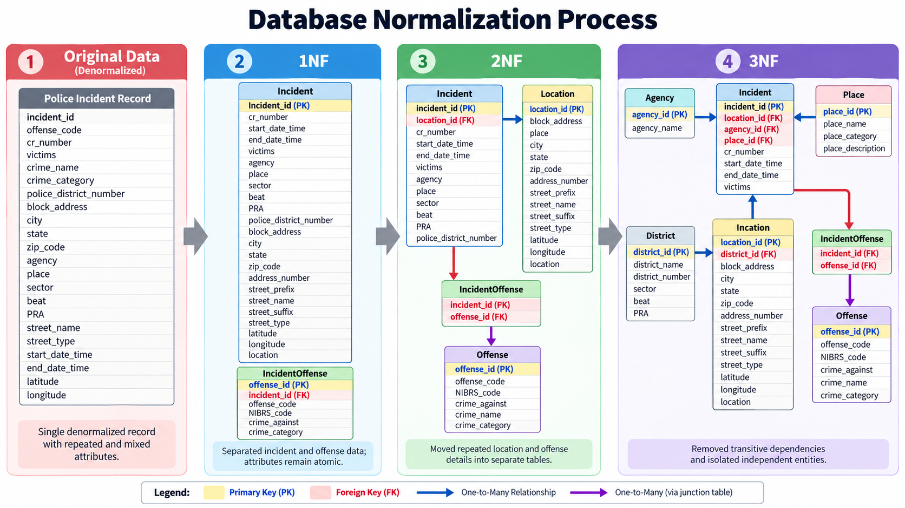

# Database Normalization

This document explains how the Montgomery County police incident dataset was normalized into the final relational database structure used in this project.

## Original Data

The original dataset contained many different types of information in the same record, including:

- Incident information
- Offense information
- Police agency information
- District information
- Location information
- Place information
- Date and time information

Because these values were repeated across many incident records, the original structure contained a large amount of redundant data.

Examples of repeated information included:

- Agency names
- Police district names and numbers
- Offense descriptions
- Place categories
- Location details

The normalization process separated these values into related tables so that each type of information could be stored once and referenced through keys.

## Benefits of Normalization

The normalization process improved the database by:

- Reducing duplicated data
- Improving data consistency
- Making updates easier to manage
- Reducing the risk of update, insert, and delete anomalies
- Making relationships between entities clearer
- Improving the overall maintainability of the database

## First Normal Form (1NF)

The first step was to ensure that attributes contained atomic values and that each record could be uniquely identified.

Incident information was separated from offense information.

The primary structures at this stage included:

### Incident

The incident table stored information such as:

- Incident ID
- Crime report number
- Start and end date/time
- Number of victims
- Agency
- Place
- District information
- Address information

### IncidentOffense

Offense-related information was separated from the main incident record.

This allowed individual incidents to be associated with one or more offenses.

## Second Normal Form (2NF)

The next step was to reduce repeated information that did not depend entirely on the primary key of the incident record.

Location data was separated into its own table.

Offense descriptions were also separated into an independent `offense` table.

The database began using relationships such as:

```text
Incident → Location
Incident → IncidentOffense
IncidentOffense → Offense
```

This reduced the need to repeat complete address and offense descriptions for every incident.

## Third Normal Form (3NF)

The final step was to remove transitive dependencies and separate information that depended on other non-key attributes.

Additional entities such as police agencies, districts, and place types were moved into their own tables.

The final database structure included:

### Incident

The `incident` table stores the main information for each police incident.

Important fields include:

- `incident_id`
- `location_id`
- `agency_id`
- `place_id`
- `cr_number`
- `Start_Date_Time`
- `End_Date_Time`
- `victims`

### Location

The `location` table stores address and geographic information.

Important fields include:

- `location_id`
- `district_id`
- `block_address`
- `city`
- `state`
- `zip_code`
- `street_name`
- `latitude`
- `longitude`

### District

The `district` table stores police district information.

Important fields include:

- `district_id`
- `district_name`
- `district_number`
- `sector`
- `beat`
- `PRA`

### Agency

The `agency` table stores information about the law enforcement agency associated with an incident.

Important fields include:

- `agency_id`
- `agency_name`

### Place

The `place` table stores information about the type of location where an incident occurred.

Important fields include:

- `place_id`
- `place_name`
- `place_category`
- `place_description`

### Offense

The `offense` table stores information about individual offense types.

Important fields include:

- `offense_id`
- `offense_code`
- `NIBRS_code`
- `crime_against`
- `crime_name`
- `crime_category`

### IncidentOffense

The `incidentoffense` table acts as a junction table between incidents and offenses.

An incident can contain multiple offenses, while the same offense type can be associated with many different incidents.

This creates a many-to-many relationship between:

```text
Incident ↔ Offense
```

## Normalization Diagram



## Final Database Design

The completed entity relationship diagram for the normalized database can be viewed here:

[View Final ER Diagram](../ERD.png)
